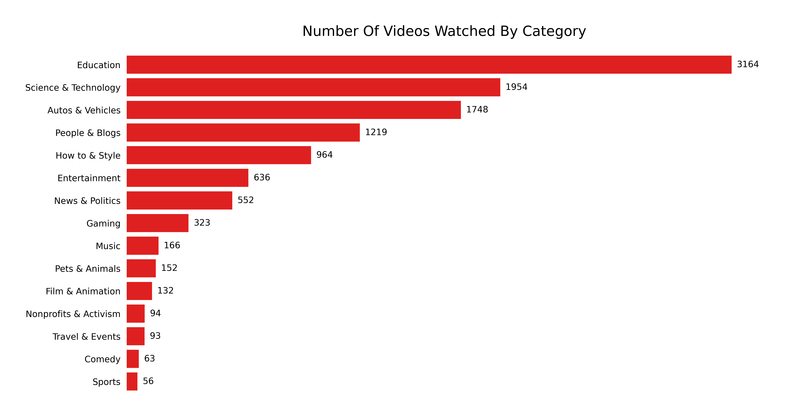
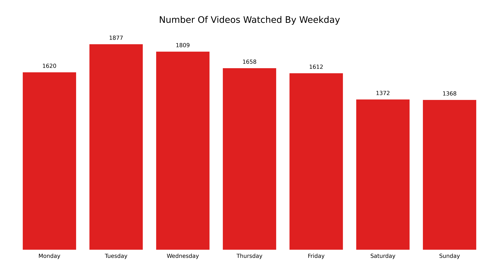
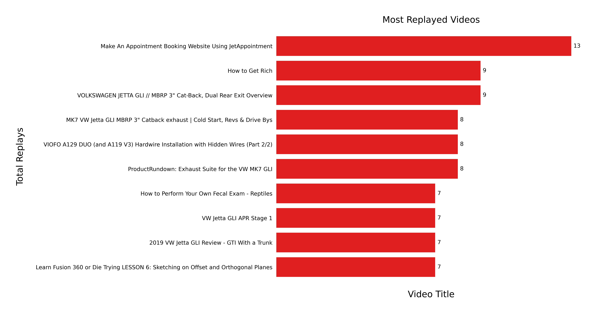

# YouTube Watch History Assistant

## Problem and who this is for:
You have probably watched at least one life-changing video on YouTube, like a Ted Talk on how to learn effectively or a review of a car that convinced you to buy it. That video wasn't like the rest. It was special. It was clear and thorough.

But did you save it in a list? Odds are you probably didn't. Now you wish you did. You wish you had a list containing some of the best videos you watched this year. You wish you could easily filter through your entire search history for those special videos. 

You feel like you're missing out on some motivation, a key idea, or a new insight. Maybe a friend brings up a situation they are struggling through and you remember that YouTube helped you through the same situation, but you don't remember what video in particular.

Wouldn't it be great if there was a way to search your YouTube history for the most impactful videos you have ever watched? 

## Solution:

The goal for this project is to create a Web App that will allow users to easily find **** high-value videos **** that they have already watched. 

The app will require the users' YouTube watch history which can be downloaded from [Google Takeout](https://takeout.google.com/settings/takeout). 

After the history has been submitted. The user will be able to instantly view key Insights like:

- Average daily watch time
- Favorite Video Category

- Favorite Channel

- Weekday with the most watch time

- Videos rewatched the most times

Key insights are great, but here is where the real magic happens. The user will be able to search for high-value videos by topic. 
> If the user inputs "Productivity", the app will produce a list of ten video titles that have been selected and ranked using a "Value Score" calculated in the backend by an NLP algorithm. 

These videos can then be rewatched or shared with friends and family. 

## Project hurdles and solutions:
- YouTube API Key
- YouTube API calls
- Create a Virtual env
- Setting a Kernel in Jupter Notebook
- Using a JSON formatter
- Max id requests
- Pandas Functions
- Pandas Date and Time
  - Extract Weekday
  - Sort by Weekday
  - Filter by Year
  - Filter out live streams
- NLTK Wordclouds
- Duplicates
- Extracting comments
- Bag of words
- RoBERTa pre-trained model
- Tensorflow

## Current work:
Videos that disabled comments are crashing my get_video_comments function 

